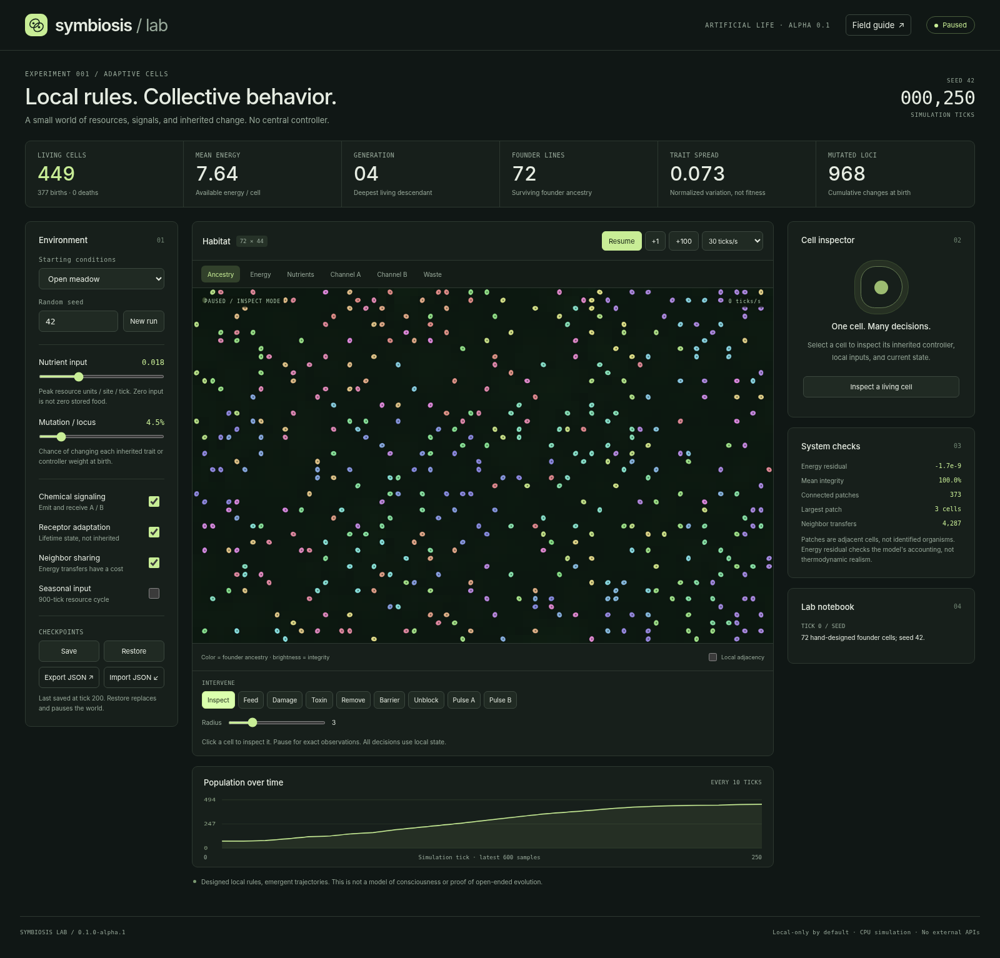

# Symbiosis Lab

[](https://github.com/JerrettDavis/symbiosis-lab/actions/workflows/ci.yml)
[](LICENSE)

**0.1.0-alpha.1 | An inspectable artificial-life sandbox**

Local rules. Collective behavior. A Dockerized, CPU-only simulation of cells that acquire resources, emit and interpret signals, maintain themselves, reproduce, and inherit mutations. The browser exposes the mechanism, not just an animation.



## Run with Docker

From this directory:

```sh
docker compose up --build
```

Open **http://localhost:8080**. No accounts, API keys, GPU, database, or external service is required. The first image build requires Internet access for the Node base image and development packages. The running application makes no external requests.

For background operation:

```sh
docker compose up --build -d
docker compose logs -f lab
docker compose down
```

`down` retains the named checkpoint volume. **`docker compose down -v` permanently deletes it.** Copy `.env.example` to `.env` and change `LAB_PORT` when 8080 is already occupied. `LAB_PAUSED=true` starts an existing or new world paused.

The Dockerfile and Compose configuration are supplied, including a health check, non-root user, read-only root filesystem, resource limits, and a persistent volume. CI builds and runs the container, including checkpoint recovery after restart. See [validation coverage](docs/VALIDATION.md) and the linked workflow for results.

## Run directly

Node 22.16+, 24, or 26. The ZIP attached to a [GitHub release](https://github.com/JerrettDavis/symbiosis-lab/releases) includes the already-compiled `dist/` directory, so this works without installing dependencies:

```sh
npm start
```

For a source checkout or after editing TypeScript:

```sh
npm ci
npm run dev
```

`dev` builds once and starts the server; it is not a hot-reload watcher. The local server binds to `127.0.0.1` by default. On Windows PowerShell, select another port with `$env:PORT=8090; npm start`. On Linux/macOS: `PORT=8090 npm start`.

## What works

| Mechanism | Implementation |
|---|---|
| Local environment | A 72 × 44 lattice with nutrient, waste, and two diffusing signal fields; impermeable barriers |
| Stateful cells | Energy, integrity, age, stress memory, two receptor gains, ancestry, and genome |
| Local controller | Seven inputs and seven sigmoid outputs; 49 inherited weights, 11 bounded inherited traits |
| Homeostasis | Resource uptake pays for upkeep, signaling, motion, repair, sharing, and division |
| Lifetime adaptation | Receptor gains adapt to persistent chemical exposure; offspring start with fresh gains |
| Heredity and variation | Asexual division copies traits and weights with per-locus mutation |
| Selection | Local competition, energy costs, finite lifespan, and reproductive success; no global fitness ranking |
| Inspection | Cell inputs, action gates, traits, weights, parent, founder lineage, and current state |
| Interventions | Feed, damage, toxin, remove, barriers, unblock, pulse A, pulse B; changes appear in the notebook |
| Experiments | Disable signaling, adaptation, sharing, mutation, or external nutrient supply; change seed or seasons |
| Repeatability | Full-precision JSON checkpoint, seeded PRNG, exact resumed evolution on the same runtime/model |
| Persistence | Autosave every 30 seconds while dirty, manual save, JSON import/export, and graceful-shutdown save |

There is one authoritative world per server. All browser tabs control the same world. The simulation keeps running when the browser is closed. Extinction is real: **the engine never secretly reseeds the world**.

## First five minutes

1. Start the default meadow and let it run. Watch births, deaths, inherited mutations, and population history. Select **Inspect a living cell** or click any colored cell.
2. Pause and save. Select **Channel A**, then **Pulse A**, and click near the selected cell. Advance **+100** ticks. Compare its receptor gains, input values, and action gates.
3. Restore the checkpoint, disable **Chemical signaling**, repeat the same pulse, and advance the same number of ticks. Signaling is now absent from sensing and secretion, although existing fields continue to diffuse and decay.
4. Damage a patch, introduce toxin, or draw a barrier. Inspect what changes. A barrier blocks movement and diffusion; it is not just a visual overlay.
5. Export the world to JSON before a destructive reset. Import or restore always pauses the world.

A comparison is not automatically evidence of benefit. The signal knockout also removes secretion costs, and trajectories consume random draws differently after they diverge. Use the [experiment protocol](docs/EXPERIMENTS.md) for interpretation.

## Reproducible headless experiments

Build once, then run matched-initial-state variants:

```sh
npm run build
npm run experiment -- --seeds=1,7,42 --ticks=2000 --out=data/experiments
```

Inside the running container, no host Node installation is needed:

```sh
docker compose exec lab node dist/server/experiment.js --seeds=1,7,42 --ticks=2000 --out=/data/experiments
docker compose cp lab:/data/experiments ./data/experiments
```

Each seed runs baseline, signaling-off, receptor-adaptation-off, and mutation-off variants. Outputs include per-run JSON histories, final metrics, SHA-256 state checksums, and combined CSV/JSON tables. No LLM or paid service is involved. Example results are included in [examples/experiments](examples/experiments).

A full sample checkpoint is included at [examples/seed-42-tick-250.json](examples/seed-42-tick-250.json). Import it through the UI to inspect the screenshot's state.

## Tests

```sh
npm ci
npm run verify
```

This compiles the complete project, runs engine and HTTP tests, and starts/restarts the actual application process to verify persistence. Cross-platform wrappers: `scripts/verify.sh` and `scripts/verify.ps1`.

Optional browser checks:

```sh
python -m pip install -r scripts/requirements-test.txt
python -m playwright install chromium
npm run test:browser
```

Optional container checks, requiring a running Docker daemon:

```sh
npm run test:docker
```

The Docker test builds the image, checks readiness, exercises the API, persists a checkpoint, restarts the container, verifies exact recovery, and removes only its temporary test project/volume. GitHub Actions runs these checks alongside release packaging and clean extraction. See the workflow badge above for the current result.

## What this demo does not establish

This is a **toy artificial-life model, not a biological simulator or consciousness model**. It does not prove perpetual survival, open-ended novelty, intelligence, evolved symbiosis, or multicellular individuality. Spatial clusters are measured, not promoted to organisms. Founder colors are ancestry labels, not species.

The starting cells, reproduction machinery, resource source, available actions, and two communication channels are explicitly designed. Mutation changes a bounded set of numbers; it does not invent arbitrary APIs, rewrite source code, or access the host. Receptor adaptation is a hand-designed feedback rule, not demonstrated associative learning or backpropagation. A cell's persistent stress variable is a simple exponential moving average, not episodic memory.

Unlike a trained neural cellular automaton, this release has no gradient-trained morphogenesis, target image, GPU training, or learned body plan. It provides a smaller, transparent baseline on which those extensions can be tested.

## Repository map

```text
src/engine/       Pure, seeded simulation, controllers, types, validation
src/server/       HTTP server, clock, checkpoints, headless experiments
src/web/          Browser UI and Canvas renderer
public/           HTML, CSS, icon; no CDNs or external fonts
tests/            Engine, numerical accounting, architecture, and API checks
scripts/          Build, actual-process smoke, browser and Docker tests
docs/             Model, architecture, roadmap, experiments, validation
examples/         Full checkpoint and actual experiment outputs
dist/             Prebuilt release output; regenerated by npm run build
Dockerfile        Two-stage build; tests run in build stage
compose.yaml      One service, one named data volume
```

See [Architecture](docs/ARCHITECTURE.md), [Model specification](docs/MODEL.md), [Roadmap](docs/ROADMAP.md), [Validation](docs/VALIDATION.md), and [Security](SECURITY.md).

## Research context

This implementation is original, not a port of the following projects:

- Mordvintsev, Randazzo, Niklasson, and Levin, [Growing Neural Cellular Automata](https://distill.pub/2020/growing-ca/) (2020). Inspiration for local updates and perturbation-based inspection. That work learns growth/regeneration rules; this demo does not implement that training procedure.
- [Avida](https://avida.devosoft.org/), a platform for digital evolution. Inspiration for heredity, ecological constraints, and reproducible experiments. Our cells are not Avida's self-replicating instruction programs.
- [Node release policy](https://nodejs.org/en/about/previous-releases) and [Docker Compose readiness guidance](https://docs.docker.com/compose/how-tos/startup-order/) inform runtime and operational choices.

MIT licensed. No external assets, model weights, telemetry, or credentials are bundled.

## Contributing and maintenance

See [Contributing](CONTRIBUTING.md), the [code of conduct](CODE_OF_CONDUCT.md), and [changelog](CHANGELOG.md). Use the GitHub issue forms for reproducible bugs and feature proposals. Dependabot groups dependency updates weekly, with patch/minor auto-merge gated by required CI. Major updates require review. [Maintainer documentation](docs/MAINTAINING.md) describes repository settings and releases.
